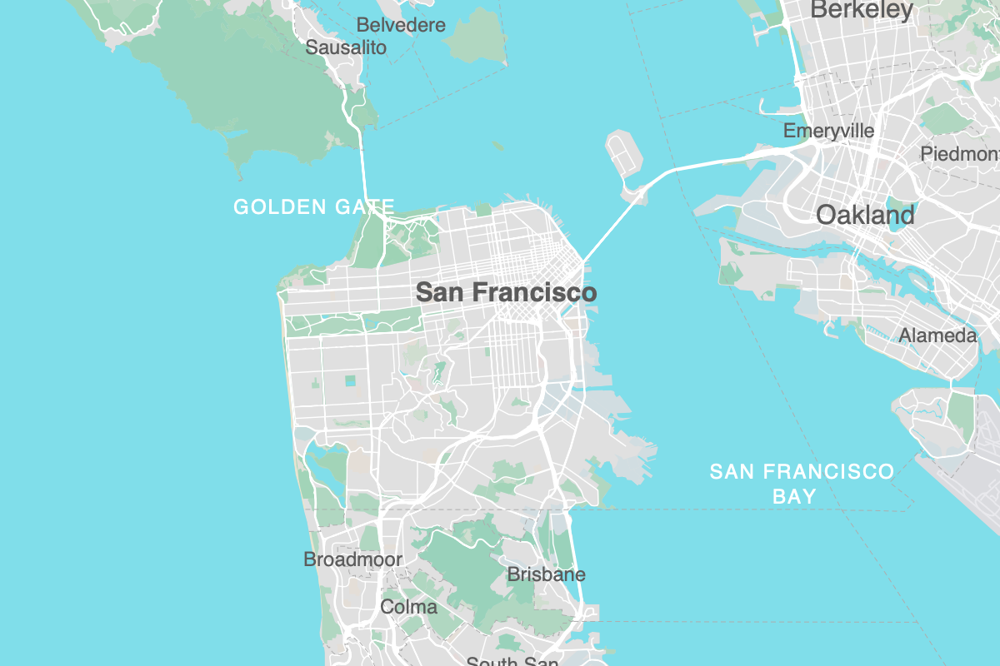

# protomaps.js

A vector map renderer for the web.

[](https://www.npmjs.com/package/protomaps)
[](https://github.com/protomaps/protomaps.js/actions/workflows/node.js.yml)
[](https://bundlephobia.com/package/protomaps)

<p float="left">
    
    
</p>

This project is a complete web map renderer - including quality label layout, pattern fills, and icons - in as simple as possible of an implementation. It's an alternative to renderers like [Mapbox GL JS](https://docs.mapbox.com/mapbox-gl-js/api/) in a fraction of the size.

### Features

* Render static maps to Canvas elements or interactive maps with [Leaflet](https://leafletjs.com) integration
* Supports variable web fonts with multiple weights and italics in a single font file
* Can read normal Z/X/Y tile URLs or offline, S3-hosted tile archives in [PMTiles format](github.com/protomaps/PMTiles)
* Full out-of-the-box support for right-to-left and Indic/Brahmic writing systems
* Configurable via plain JavaScript
* Extensible API for defining your own symbolizers

See the docs on [what protomaps.js is, what protomaps.js is not](https://protomaps.com/docs/protomaps-js#protomapsjs-is-not)

## Demos

* [Simple Leaflet demo](https://protomaps.github.io/protomaps.js/examples/leaflet.html)
* [Multi-language customization](https://protomaps.github.io/protomaps.js/examples/multi_language.html)
* [Satellite + labels demo](https://protomaps.github.io/protomaps.js/examples/labels.html)
* [GeoJSON between basemap and labels demo](https://protomaps.github.io/protomaps.js/examples/sandwich.html)
* [JSON style](https://protomaps.github.io/protomaps.js/examples/json_style.html)
* [Map inset](https://protomaps.github.io/protomaps.js/examples/inset.html)
* [PostGIS](https://protomaps.github.io/protomaps.js/examples/postgis.html)
* [Custom fonts](https://protomaps.github.io/protomaps.js/examples/fonts.html)

## How to use

```html
<script src="https://unpkg.com/protomaps@latest/dist/protomaps.min.js"></script>
<script>
    const map = L.map('map')
    var layer = protomaps.leafletLayer({url:'FILE.pmtiles OR ENDPOINT/{z}/{x}/{y}.pbf'})
    layer.addTo(map)
</script>
```

Exports of OpenStreetMap data in PMTiles format can be obtained from [https://protomaps.com/bundles](https://protomaps.com/bundles).

## Project Status

The design is still evolving rapidly, so do not expect any kind of stable internal or external-facing API between minor versions. But please do report bugs and discuss requirements in the Issues.

## See Also
* [KothicJS](https://github.com/kothic/kothic-js)
* [Tangram](https://github.com/tangrams/tangram)
